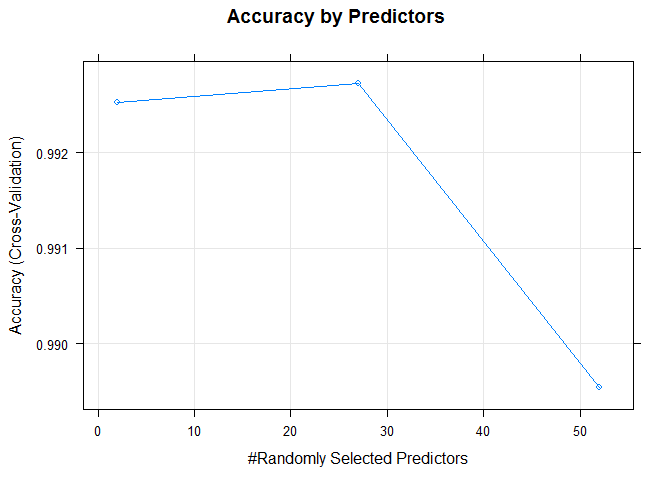

Prediction Assignment Writeup
================
MZANIN
September 25, 2016

Project overview
================

This project uses data sets downloaded from the Human Activity Recognition website (<http://groupware.les.inf.puc-rio.br/har>). The researchers developed this data set by recording "users performing the same activity correctly and with a set of common mistakes with wearable sensors". The classifier variable is classified such that "class A corresponds to the specified execution of the exercise, while the other 4 classes correspond to common mistakes"(<http://groupware.les.inf.puc-rio.br/public/papers/2013.Velloso.QAR-WLE.pdf>). The purpose of this project is to develop a prediction model that will accurately predict the aformentioned classifier.

``` r
library(caret)
library(randomForest)
library(parallel)
library(doParallel)
cluster <- makeCluster(detectCores() - 1)
registerDoParallel(cluster)
```

``` r
##read data
train <- read.csv("https://d396qusza40orc.cloudfront.net/predmachlearn/pml-training.csv", header = TRUE, na.strings = c("","", "NA"))
test <- read.csv("https://d396qusza40orc.cloudfront.net/predmachlearn/pml-testing.csv", header = TRUE, na.strings = c("","", "NA"))
```

Exploratory Data Analysis
-------------------------

``` r
View(train)
```

Using the View() function we can inspect that many of the variables have a large number of NA values. The code below quntifies this indicating there are only 406 out of 19622 complete cases.

``` r
dim(train)
```

    ## [1] 19622   160

``` r
complete <- complete.cases(train)
table(complete)
```

    ## complete
    ## FALSE  TRUE 
    ## 19216   406

Data cleaning
-------------

Taking into account the significant number of variables with a majority of observations as missing cases, I retain only those variables with complete cases:

``` r
train_com <- train[,colSums(is.na(train)) == 0]
test_com <- test[,colSums(is.na(test)) == 0]
```

I then remove the first seven columns that will not provide relevant data to the training model. These include the user name, time stamps and the window numbers.

``` r
train_com <-train_com[,-c(1:7)]
test_com <-test_com[,-c(1:7)]
train_com <- train_com[, sapply(train_com[,c(1:52)], is.numeric)]
test_com <- test_com[, sapply(test_com, is.numeric)]
```

The dimensions of the cleaned data sets are provided below

``` r
dim(train_com)
```

    ## [1] 19622    53

``` r
dim(test_com)
```

    ## [1] 20 53

Training Model
--------------

I divide the cleaned training data set into a training and test set.

``` r
set.seed(32323)
inTrain <- createDataPartition(y = train_com$classe, p = .75, list = FALSE)
training <- train_com[inTrain,]
testing <- train_com[-inTrain,]
```

Given the relatively high dimensionality of this data set, I use a random forest algorithm with ten fold cross validation to fit this model due to its commonly held accuracy with respect to predicting non-linear relationships between response and predictor variables and approach to decorrelating trees by varying the predictor subset size at each split across all trees.

``` r
control <- trainControl(method = "cv", number = 10, allowParallel = TRUE)
modfit <- train(classe ~., data = training, method = "rf", trControl = control)
print(modfit)
```

    ## Random Forest 
    ## 
    ## 14718 samples
    ##    52 predictor
    ##     5 classes: 'A', 'B', 'C', 'D', 'E' 
    ## 
    ## No pre-processing
    ## Resampling: Cross-Validated (10 fold) 
    ## Summary of sample sizes: 13247, 13246, 13244, 13247, 13246, 13246, ... 
    ## Resampling results across tuning parameters:
    ## 
    ##   mtry  Accuracy   Kappa    
    ##    2    0.9925250  0.9905438
    ##   27    0.9927288  0.9908019
    ##   52    0.9895349  0.9867610
    ## 
    ## Accuracy was used to select the optimal model using  the largest value.
    ## The final value used for the model was mtry = 27.

As indicated by the output above, the best model fit uses 27 of the 52 predictors with an accuracy of ~.99. A graph comparing model accuracy with the number of predictors selected can be reviewed in the Appendix.

I apply the model to the test set to assess accuracy with respect to the same.

``` r
prediction <- predict(modfit, newdata = testing)
confusionMatrix(prediction, testing$classe)
```

    ## Confusion Matrix and Statistics
    ## 
    ##           Reference
    ## Prediction    A    B    C    D    E
    ##          A 1394   10    0    0    0
    ##          B    0  936    0    0    0
    ##          C    1    3  853    6    2
    ##          D    0    0    2  798    2
    ##          E    0    0    0    0  897
    ## 
    ## Overall Statistics
    ##                                           
    ##                Accuracy : 0.9947          
    ##                  95% CI : (0.9922, 0.9965)
    ##     No Information Rate : 0.2845          
    ##     P-Value [Acc > NIR] : < 2.2e-16       
    ##                                           
    ##                   Kappa : 0.9933          
    ##  Mcnemar's Test P-Value : NA              
    ## 
    ## Statistics by Class:
    ## 
    ##                      Class: A Class: B Class: C Class: D Class: E
    ## Sensitivity            0.9993   0.9863   0.9977   0.9925   0.9956
    ## Specificity            0.9972   1.0000   0.9970   0.9990   1.0000
    ## Pos Pred Value         0.9929   1.0000   0.9861   0.9950   1.0000
    ## Neg Pred Value         0.9997   0.9967   0.9995   0.9985   0.9990
    ## Prevalence             0.2845   0.1935   0.1743   0.1639   0.1837
    ## Detection Rate         0.2843   0.1909   0.1739   0.1627   0.1829
    ## Detection Prevalence   0.2863   0.1909   0.1764   0.1635   0.1829
    ## Balanced Accuracy      0.9982   0.9932   0.9973   0.9958   0.9978

As noted in the output above, the model accuracy is ~.9947 with respect to the test set. The out of sample error is a calculation of the error found by applying a prediction model to a test set and can be calculated as (1 - test set accuracy)\*100:

``` r
(1 - .9946982) * 100
```

    ## [1] 0.53018

As such the out of sample error for this model is .53%

Test set predictions
--------------------

A test set of 20 observations was provided as part of this project. The predictions for the same using the model created above are provided below:

``` r
predict(modfit, test)
```

    ##  [1] B A B A A E D B A A B C B A E E A B B B
    ## Levels: A B C D E

Appendix
========

``` r
plot(modfit, main = "Accuracy by Predictors")
```


